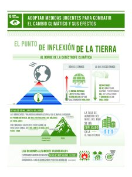
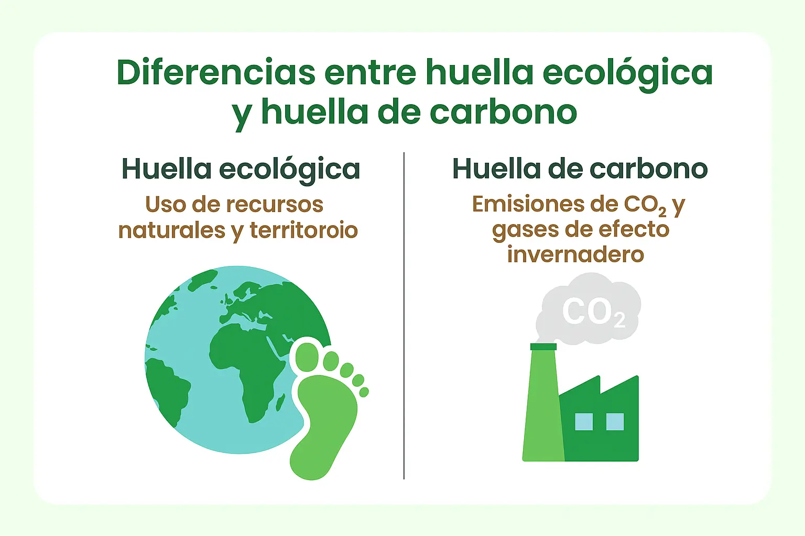
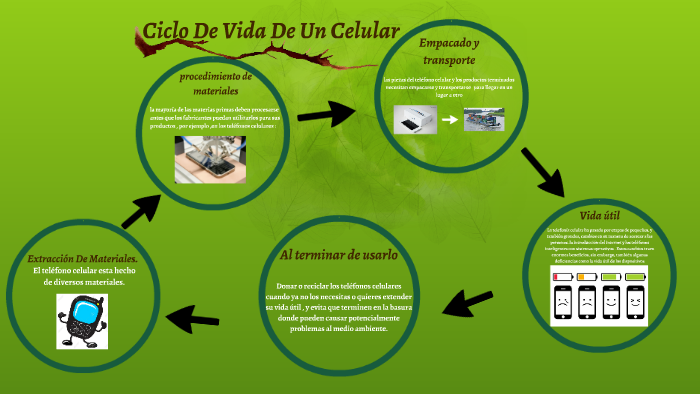

# NOVIEMBRE

# Cambio Climático: El multiplicador de amenazas 
# Fecha: 12/12/2025

Es un analisis que abordan los impactos que conectan un planeta en calentamiento con los sistemas que definen nuestro futuro.
El cambio climático actúa como un multiplicador de amenazas porque intensifica problemas ya existentes como la escasez de agua, la inseguridad alimentaria, los conflictos sociales y las crisis económicas haciéndolos más frecuentes y más difíciles de gestionar. No crea todas las crisis por sí mismo, pero las amplifica y acelera

**Resumen de lo hablado en clase**
La quema de combustibles fósiles modifica la composición de la atmósfera, aumentando el efecto invernadero y acelerando el calentamiento global.

Los estudios muestran que el cambio climático incrementa las muertes por eventos extremos, afecta empleos en sectores sensibles, amplía la población vulnerable y eleva los costes sanitarios.

Las alteraciones en el clima reducen la disponibilidad de agua y la producción de alimentos, generando tensiones que impulsan desplazamientos y migraciones.

La transición implica inversiones y riesgos económicos, pero la inacción genera daños físicos mucho más costosos y persistentes.

Los países compiten por recursos estratégicos y nuevas oportunidades, reconfigurando equilibrios de poder a medida que el clima cambia.

Exigen transformar el sistema energético mediante renovables, movilidad sostenible, eficiencia energética y estrategias de economía circular.

## ¿Cual es el principal emisor de CO2?
El principal emisor son las empresas productoras y uso de energía, por ejemplo; El transporte, Industrias pesadas de acero o cemento y centrales de carbón, gas y petroleo.
En cuanto a paises el mayor productor actualmente de CO2 es china, con un 30% de emisiones debido a su indrustria y la dependencia de combustibles fósiles para energía.

## ¿que puedo hacer yo como programadpor para mitigar el cambio climatico?

Pienso que reducir el tiempo de procesamiento, energia o infraestructura ayudaría. 
Algunas ideas podrían ser optimizar el consumo de memorias o CPU/GPU para que utilicen menos energía, utilizar infraestructura en la nube, hacer teletrabajo que evitan viajes o infraestructura fisica. 

Ejemplo: OpenIA necesita optimizar la consumicion de recursos como la energia utilizada o agua por cunsulta. El creador de OPENIA dió la idea de que utilizará una fusión nuclear para alimentar los centros de datos o colocar centros de datos en el espacio aprovechando energia solar.

# La huella ecologica y la huella de carbono  Fecha:02/12/2025 (Falté a clase)

**La huella ecologica**
Mide el espacio que necesitamos para producir nuestra comida, vestirnos, tener energía y manejar nuestros desechos.

**La huella de carbono**
Se enfoca en la cantidad de gases que emitimos a la atmósfera, especialmente el CO₂, cuando usamos transporte, electricidad o producimos bienes.

## ¿Cual es mi huella de carbono?

Personalmente mi huella de carbono puede ser de 2,5 toneladas de CO2 al año, por ejemplo no utilizo un transporte, solo caminando.
La compra la hago 1 vez a la semana y procuro cocinar con alimentos frescos.
La electricidad que consumo es el promedio de lo que consume una unica persona.
Y tampoco hago muchas compras de ropa u otros objetos, solo lo necesario.

# Economía lineal vs Circular  Fecha: 28/11/2025

## Economía lineal
La **economía lineal** se basa en un flujo unidireccional de recursos, ignorando los límites planetarios y priorizando la velocidad de producción sobre la sostenibilidad.  

**Flujo unidireccional:**  
Extracción → Producción → Consumo → Residuo.

**Consecuencia del modelo lineal:** Tiene un impacto sostenible negativo como el agotamiento de recursos, residuos, contaminación, etc.

Otros efectos del modelo lineal:
- Generación masiva de residuos difíciles de gestionar  
- Uso excesivo de recursos naturales  
- Elevada huella ambiental  
- Producción de bienes de corta vida útil para aumentar el consumo constante  

---

## Economía circular
El **modelo circular** es mejor para la sociedad y para las empresas. Mantiene los productos en uso durante más tiempo y reduce los residuos.

**Principios:**
- Ecodiseño  
- Prioridad: reutilización y reparación  
- Integración ecosistémica  

Beneficios de la economia circular:
- Reducción de costes empresariales  
- Creación de empleo en reparación, reciclaje e innovación  
- Disminución del impacto ambiental  
- Nuevos modelos de negocio (servicios, alquiler, sharing, etc.)  

---

## Economía verde
La **economía verde** busca integrar la sostenibilidad ambiental en el ámbito económico, social y del entorno.

**Ejemplo:** al fabricar un coche que deja residuos y no se puede hacer nada con ellos, es mejor fabricarlo con materiales que se puedan reutilizar.

---

# Pregunta de la semana y opinión personal

## ¿Y a mí qué me cuentas?
¿En qué me afecta el ecodiseño? ¿Qué puedo hacer con eso?

A nivel personal el ecodiseño influye en la calidad y durabilidad de los productos, la cantidad de residuos que generas  y el coste económico a largo plazo.

Acciones individuales:
- Comprar productos duraderos y reparables  
- Elegir opciones reutilizables  
- Reparar antes que reemplazar  
- Consumir conscientemente  

---

## ¿Enfoque colectivo o individual?
¿Qué es mejor: políticas colectivas que impulsen la economía circular o acciones individuales?

Como opinión personal yo creo que lo mejor sería una combinación de ambos enfoques, ya que por un lado el enfoque colectivo puede aportar politicas públicas, normativas y obligaciones a empresas para ecodiseñar y reducir los residuos. Y con el enfoque individual promover el consumo responsable, la reparación, reutilización y reducción de materiales y hacer una presión social para hacer los cambios.

# Análisis del ciclo de vida  Fecha: 14/11/2025

- Herramientas que utilizamos para la vida diaria y las consecuencias que tiene sobre nosotros, despues de hacer el analisis por ejemplo para obtener los materiales para crear un telefono, se han consumido 80kg. Esquema que extrae los materiales para fabricar un telefono y las energias que existen a dia de hoy, posteriormente de la fabricación del telefono.

## ¿De dónde sale ese peso oculto? ¿Qué es?

- Es cuando hay una diferencia muy grande de lo que hemos extraido de la naturaleza y el objeto que queremos obtener con esos materiales.

- Del análisis de las etapas en la fabricación en este caso de un telefono, donde se analiza la obtención de las materias primas, energia utilizada, recursos, consecuencias de su fabricación y los residuos que deja.

### Hay distintas etapas:
- Materias primas, fabricacion, distribucion, gestion final, uso

### Podemos comparar el peso oculto de diferentes objetos 
- Ejemplo un telefono movil, tostadora, ordenador, etc.

## Opinión personal
- En el caso del telefono al consumir un producto no reflexionamos en todas las consecuencias que conlleva su fabricación, el análisis del ciclo de vida hace pensar en que tenemos que prolongar lo maximo posible la vida util de un producto. Ya que como consumidores no nos damos cuenta de su impacto y los residuos que genera.

---

# Pregunta a la IA
Una de las fases del Análisis del ciclo de vida, el peso oculto, los materiales extraidos y los residuos generados.

### 🔹 Peso oculto total 
≈ 70–90 kg de materiales movilizados por cada teléfono.

### 🛠️ 1. Materiales movilizados
Total: 50–60 kg, procedentes de:

- Metales: 35–45 kg -> Cobre, Estaño, Aluminio, cobalto, etc.  
- Batería: 10–15 kg -> Litio, Niquel, Grafito, etc  
- Pantalla: 5–10 kg -> Vidrio, Silicio, tinta conductora, etc.  
- Plásticos: 2–4 kg -> Policarbonato, polimeros del petroleo, Abs , etc.

### ⚡ 2. Energía utilizada
≈ 200–350 MJ por teléfono  
La energía más utilizada: Electricidad generada con combustibles fósiles (carbón y gas natural)  
Representa 60–80% del total de la energía consumida en la cadena de producción.

### 🗑️ 3. Residuos generados
- Residuos mineros: 40–60 kg  
- Residuos industriales químicos: 0.5–1.5 kg  
- Residuos electrónicos finales: 150–200 g (si no se recicla)

### Como conclusión
Un móvil de 180 g requiere 70–90 kg de materiales movidos, consume energía dominada por electricidad procedente de carbón y gas natural, y genera decenas de kilos de residuos mineros.

---

# Bitácora Octubre

## DÍA 4 — Fecha 31/10/2025

### Idea sostenible
- Mi idea sostenible es el compostaje domestico de residuos organicos para reducir los desechos.

---

## DÍA 3 — Fecha 24/10/2025

### ¿Qué estrategia usamos los humanos? (K o R)
- Nuestra especie humana, somos una especie que seguimos la estrategia K, ya que nos interesa permanecer en un equilibrio constante y no sufrir cambios constantes a los que tenemos que adaptarnos, aunque la vida en algún momento impone algunos cambios donde nos tenemos que adaptar, pero siempre volveremos a nuestra estabilidad inicial.

---

## DÍA 2 — Fecha 17/10/2025

### ¿Qué hacemos nosotros: Cooperamos o Competimos?
- Creo que podemos hacer las dos cosas dependiendo de la situación en la que se encuentre la persona.  
  Por ejemplo en el ambito empresarial, los empresarios compiten entre ellos para posicionarse en el mercado, pero tambien pueden colaborar con otros empresarios para obtener una relación o benefició en común.

---

## DÍA 1 — Fecha 10/10/2025

### ¿Hay un limite para la población humana?
- En principio si, ya que los recursos del planeta son limitados, si llegaramos al limite, posiblemente la humanidad buscaria opciones para solucionar el problema, pero no se sabe que pasará.

---

# Septiembre

## Clase 1 Sostenibilidad — Fecha 19/09/2025
- Miguel nos explicó en que consistira la asignatura y el trabajo, una pagina web en equipos.

## Clase 2 Sostenibilidad — Fecha 26/09/2025
- Se a debatido en clase que es la sostenibilidad, ecologia, ecologismo y otros conceptos, además hemos decidido que civilización hacer para el trabajo.

## Clase 3 Sostenibilidad — Fecha 03/10/2025
- Hemos hablado sobre la diferencia entre los animales y los humanos. Tambien he entregado mi repositorio de GitHub y hemos hecho un repositorio compartido de equipo.

---

## ¿Acabaremos con la vida de nuestro planeta?
- La humanidad y con los avances tecnologicos tal vez a largo plazo acabemos con nuestra propia vida, pero no con el planeta entero, ya que el planeta tiene muchos más seres vivos o vida, aparte de nosotros los humanos, creo que aunque nosotros no estemos o existamos en el planeta, el planeta seguira su curso o naturaleza, pues nosotros somos muy pequeños comparados con él.

### ¿Qué son los hombres comparados con las rocas y las montañas?
